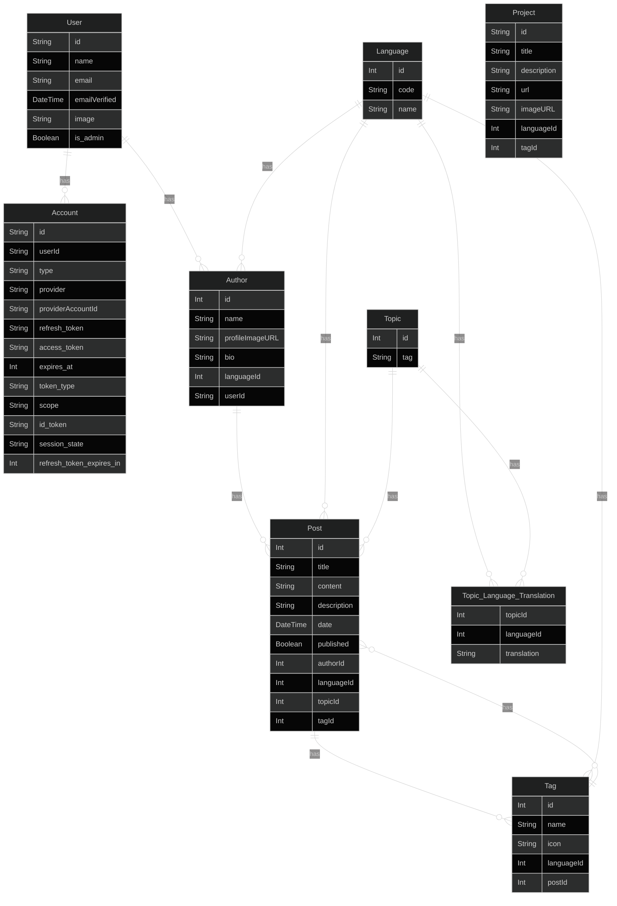

# Database Schema

This ER diagram represents the database schema.

```mermaid
%%{init: {'theme':'dark'}}%%
erDiagram
User ||--o{ Account : has
User ||--o{ Author : has

Author ||--o{ Post : has
Post ||--o{ Tag : has
Tag ||--o{ Post : has

Language ||--o{ Post : has
Language ||--o{ Tag : has
Language ||--o{ Author : has
Language ||--o{ Topic_Language_Translation : has

Topic ||--o{ Post : has
Topic ||--o{ Topic_Language_Translation : has

User {
    String id
    String name
    String email
    DateTime emailVerified
    String image
    Boolean is_admin
}

Account {
    String id
    String userId
    String type
    String provider
    String providerAccountId
    String refresh_token
    String access_token
    Int expires_at
    String token_type
    String scope
    String id_token
    String session_state
    Int refresh_token_expires_in
}

Author {
    Int id
    String name
    String profileImageURL
    String bio
    Int languageId
    String userId
}

Post {
    Int id
    String title
    String content
    String description
    DateTime date
    Boolean published
    Int authorId
    Int languageId
    Int topicId
    Int tagId
}

Tag {
    Int id
    String name
    String icon
    Int languageId
    Int postId
}

Language {
    Int id
    String code
    String name
}

Topic {
    Int id
    String tag
}

Topic_Language_Translation {
    Int topicId
    Int languageId
    String translation
}

Project {
    String id
    String title
    String description
    String url 
    String imageURL
    Int languageId
    Int tagId
}
```
